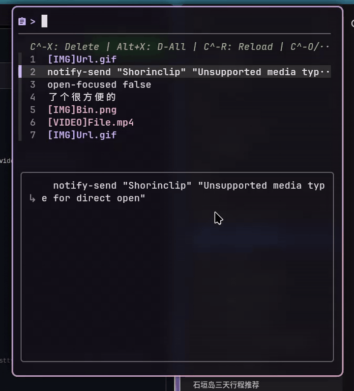

# cliphist-tui

Old name: shorinclip

A Wayland clipboard TUI with rich media (images/GIFs/videos, etc.) preview based on `fzf` `wl-clipboard` `cliphist`.

Use `chafa` for image preview, `kitty icat` for GIF preview when using native kitty, `ffmpegthumbnailer` for video thumbnail generation. In native kitty, PNG previews are sent to the terminal as a file path (kitty graphics protocol), so no decoding happens on our side.

## Preview

| Clipboard content | Preview |
|---|---|
| Image (binary / file / QQ / WeChat) | the image |
| Image copied from a browser (``) | downloads and shows the image; Enter copies the full-size image itself |
| Video | thumbnail at 10% + resolution / duration / codec |
| PDF | first page + page count |
| Audio | embedded cover + title / artist / duration |
| Text / code file | syntax highlighted content |
| Directory | listing |
| Archive | file list |
| Multiple files | file list + preview of the first one |
| JSON text | pretty printed |
| Hex color (`#ff8800`) | color swatch |

### Optional dependencies

Everything below is optional: a feature turns on when its command is found in `PATH`, otherwise the preview falls back to plain text.

| Package (Arch) | Command | Used for |
|---|---|---|
| `ffmpeg` | `ffprobe`, `ffmpeg` | video / audio info, audio cover |
| `poppler` | `pdftoppm`, `pdfinfo` | PDF preview |
| `bat` | `bat` | syntax highlighted text files |
| `eza` | `eza` | directory listing with icons |
| `libarchive` | `bsdtar` | archive listing (`unzip` is used as a fallback for zip) |
| `jq` | `jq` | JSON pretty printing |
| `mpv` | `mpv` | Ctrl+O/E opens videos in mpv |

## Showcase

- Ctrl+X delete selection



- Auto refresh when clipboard changed and Alt+X delete all


- Ctrl+E/O open videos or pictures from clipboard manager


## Installation

```
yay -S cliphist-tui-git
```

For best image preview, a terminal which supports kitty image protocol is needed, such as `kitty` or `ghostty`, or you can let chafa handle image preview (maybe low quality).

For example:

- foot

    

- alacritty

    

## Usage

Open cliphist daemon with this command:

```
wl-paste --watch cliphist store
```

When you copy an image in a browser, the browser offers both `text/html` and `image/png`, and `wl-paste --watch` without `--type` picks the HTML. cliphist-tui can still preview such an entry and copy the real image back (it downloads it), but if you want the image bytes stored in history directly, run an extra watcher for images:

```
wl-paste --type image --watch cliphist store
```

Don't start the watcher more than once (e.g. both from the compositor config and by hand in a terminal): every copy would then be stored by each of them.

Open the TUI with this command: `cliphist-tui` or `shorinclip`.

Then it just works.

Don't forget to set up autostart in your Wayland compositor's config file.

- Niri

    ```
    spawn-at-startup "wl-paste" "--watch" "cliphist" "store"
    // optional, see above
    spawn-at-startup "wl-paste" "--type" "image" "--watch" "cliphist" "store"
    ```

- Hyprland

    ```
    exec-once = wl-paste --watch cliphist store
    # optional, see above
    exec-once = wl-paste --type image --watch cliphist store
    ```
